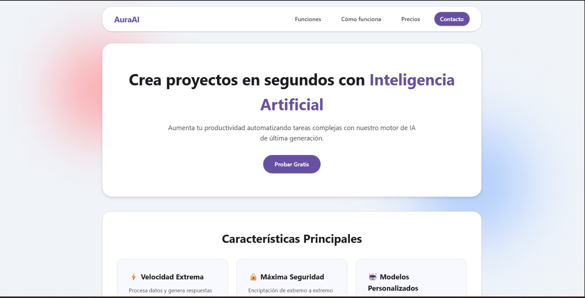
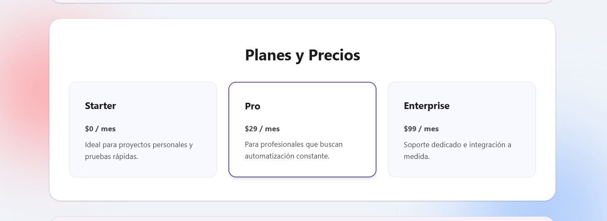

# 🤖 Inmind AI — Plataforma Inteligente de Automatización



Una landing page moderna, responsive e interactiva para **Inmind AI**, construida con **HTML5, CSS3 y JavaScript vanilla** en el frontend, respaldada por una API REST en Python desarrollada con **Flask**.

---

## 📸 Vista Previa

| Vista de la Landing Page | Planes y Funcionalidades |
| :---: | :---: |
|  |  |

---

## 🚀 Características

### 🎨 Frontend
* **Hero Section:** Presentación de impacto con llamadas a la acción (CTA).
* **Características & Funcionalidades:** Grid con las ventajas clave de la plataforma.
* **Flujo de Trabajo:** Explicación paso a paso con badges numéricos.
* **Planes y Precios:** Tarjetas de suscripción con botones de acción diferenciados.
* **Preguntas Frecuentes (FAQ):** Acordeón interactivo nativo con `<details>`.
* **Formulario de Contacto:** Envío asíncrono de mensajes a la API sin recargar la página (`fetch` API).
* **Animaciones al Scroll:** Animación de revelado progresivo (*reveal effect*) mediante `IntersectionObserver`.
* **Diseño Responsive:** Adaptable a móviles, tablets y escritorios.

### ⚙️ Backend (API REST)
* **`POST /api/contact`:** Valida y procesa las peticiones del formulario de contacto.
* **`GET /api/contact`:** Retorna la lista de contactos registrados en memoria JSON.

---

## 🛠️ Tecnologías Utilizadas

* **Frontend:** HTML5, CSS3, JavaScript (Vanilla ES6)
* **Backend:** Python 3.x, Flask, Flask-CORS

---

## 📁 Estructura del Proyecto

```text
Inmind/
├── docs/
│   ├── foto1.jpeg
│   └── foto2.jpeg
├── static/
│   ├── css/
│   │   └── style.css
│   └── js/
│       └── scripts.js
├── templates/
│   └── index.html
├── app.py
├── requirements.txt
└── .gitignore
```

---

## ⚙️ Instalación y Ejecución Local

1. **Clonar el repositorio:**
   ```bash
   git clone https://github.com/zxkiidev/inmind.git
   cd inmind
   ```

2. **Crear y activar un entorno virtual:**
   ```bash
   # En Windows
   python -m venv venv
   venv\Scripts\activate

   # En macOS/Linux
   python3 -m venv venv
   source venv/bin/activate
   ```

3. **Instalar dependencias:**
   ```bash
   pip install -r requirements.txt
   ```

4. **Ejecutar la aplicación:**
   ```bash
   python app.py
   ```

5. **Abrir en el navegador:**
   Ingresa a `http://127.0.0.1:5000` para ver la aplicación en funcionamiento.

---

## 📡 Endpoints de la API

### 1. Guardar mensaje de contacto
* **Ruta:** `/api/contact`
* **Método:** `POST`
* **Header:** `Content-Type: application/json`
* **Cuerpo de la petición (JSON):**
  ```json
  {
    "name": "Zadquiel",
    "email": "ejemplo@email.com",
    "message": "Hola, me interesa conocer más sobre la plataforma."
  }
  ```
* **Respuesta Exitosa (201 Created):**
  ```json
  {
    "status": "success",
    "message": "Mensaje recibido correctamente"
  }
  ```

### 2. Obtener lista de contactos
* **Ruta:** `/api/contact`
* **Método:** `GET`
* **Respuesta Exitosa (200 OK):**
  ```json
  {
    "contacts": [
      {
        "name": "Zadquiel",
        "email": "ejemplo@email.com",
        "message": "Hola, me interesa conocer más sobre la plataforma."
      }
    ]
  }
  ```

---

## 📄 Licencia

Este proyecto está bajo la Licencia MIT.
